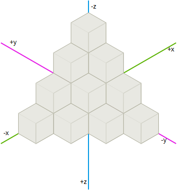
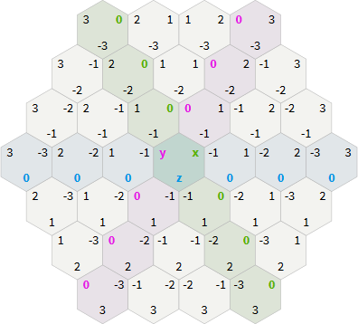
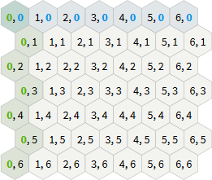

# 
Implementacja gry planszowej "Rój"

### 
Emilia Marczyńska, Julian Kwieciński

----

## Skład zespołu
- Emilia Marczyńska - interfejs użytkownika, grafika 3D
- Julian Kwieciński - koordynacja prac, implementacja zasad gry

## Uzasadnienie wyboru tematu
Gra planszowa *Rój* (ang. *Hive*) jest prostą w konstrukcji grą planszową dla dwóch osób.
Pozornie proste zasady gy stanowią jednak spore wyzwanie dla programisty implementującego
je w aplikacji. Dodatkowym utrudnieniem było przedstawienie rozgrywki pry wykorzystaniu
grafiki 3D.

Trudno jest wskazać cechy wyróżniające aplikację spośród podobnych produktów dostępnych
na rynku, ponieważ jedyna dostępna implementacja gry Rój działa na platformie Android.
Jest ona bardziej dopracowana pod kątem grafiki, jednak atutem opisywanej tutaj aplikacji
jest implementacja trzech dodatkowych rodzajów pionków dostępnych w wersji rozszerzonej
gry planszowej - Komara, Stonogi i Biedronki - które to pionki nie są dostępne w
aplikacji na Androida.

## Użytkownicy
Przewidywanymi użytkownikami aplikacji są osoby mające wcześniej kontakt z grą planszową
*Rój* - aplikacja nie zawiera instrukcji opisującej zasady poruszania się pionków.

## Ergonomia
Aplikacja jest obsługiwana przy pomocy myszy. W trakcie gry wszystkie czynności wykonywane
przez gracza są weryfikowane, co uniemożliwia wykonanie nieprawidłowego ruchu. Prez cały
czas w aplikacji widoczna jest informacja o tym który gracz aktualnie wykonuje swoją turę.

## Założenia wstępne
1. Jęyki programowania
    * F#: logika gry
    * C#: interakcja z "silnikiem" napisanym w F#, implementacja interfejsu użytkownika

2. Wykorzystane narzędzia i biblioteki
    * Visual Studio 2015: środowisko programistyczne do tworzenia aplikacji m. in. w C# i F#
    * xUnit: biblioteka obsługująca testy jednostkowe kodu w C# i F#
    * Unity: zestaw narzędzi i bibliotek do tworzenia aplikacji wykorzystujących
      grafikę 3D

3. Metody zapewnienia jakości wykonanego oprogramowania
    * Testy jednostkowe
    * Testy manualne

4. Wymagania sprzętowe
    * Komputer z systemem Windows 7 lub nowszym

5. Sposób i zasady udostępniania oprogramowania
    * Licencja: MIT
    * Sposób dystrybucji: Kod źródłowy ([dostępny tutaj](https://github.com/EMJK/hive)),
      skompilowana aplikacja (plik .exe)

## Dokumentacja techniczna
Najważniejszym zagadnieniem dotyczącym gry *Rój* jest plansza - siatka złożona z sześciokątów
foremnych. Położenie pionków na planszy można określić przy pomocy dwóch rodzajów układów
współrzędnych:

* Układ trójosiowy

 

* Układ dwuosiowy

Kod napisany w F# posługuje się ukłądem trójosiowym, łatwiejszym w użyciu przy obliczaniu
ścieżek poruszania się pionków. Kod napisany w C# posługuje się układem dwuosiowym, łatwiejszym
do wykorystania przy przedstawianiu położenia pionków w grafice 3D.

### Opis ważniejszych klas
W języku F# pojęcie *klasy* dotyczy tylko klas zaimportowanych z kodu napisanego w języku obiektowym
takim jak C#. Odpowiednikiem klas w języku F# są *moduły* - konstrukcje semantyczne grupujące
funkcje pod względem zastosowania lub tematyki.

Najważniejsze moduły w języku F#:

* *Tree*: moduł opisujący strukturę drzewa - acyklicznego grafu skierowanego - wykorzystywanego do
  wyznaczania ruchów pionków.
* *Engine*: *Silnik* gry, zawiera operacje słuące do wykonywania czynności takich jak ruch pionków
  po planszy lub umieszczanie na niej nowych pionków.

## Dokumentacja użytkowa
[Instrukcja do gry planszowej dostępna jest tutaj.](http://www.gen42.com/downloads/rules/Hive_Carbon_English_Rules.pdf)

## Testowanie i wyniki testów

## Instrukcja instalacji
